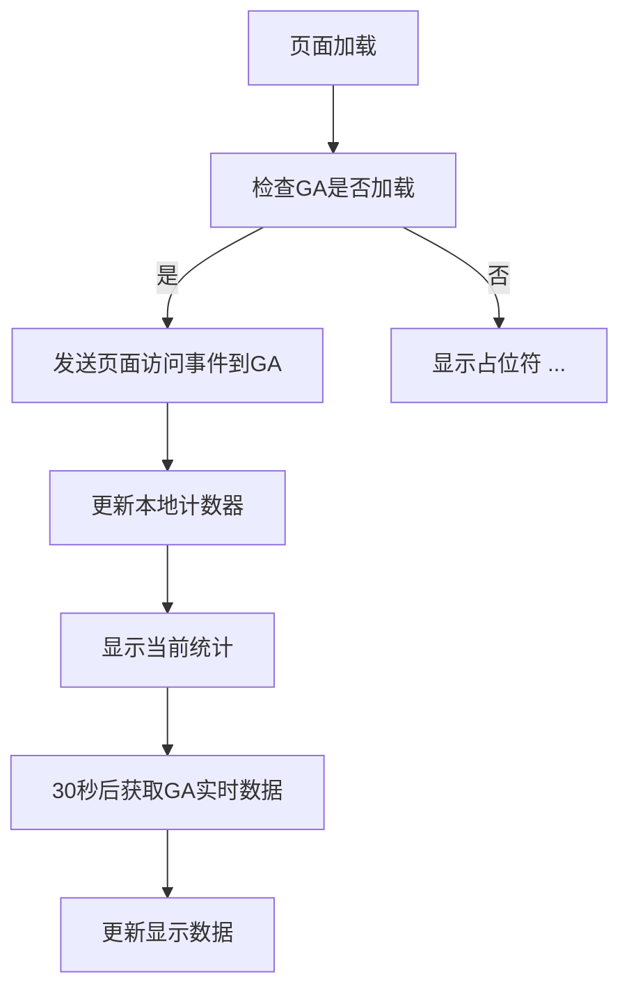

# Google Analytics 访问统计功能详解

## 📊 功能概述

在NO-FOMO AI日报主页中，我们集成了访问量统计功能，实时显示：
- **总访问量** - 网站历史总页面访问数
- **今日访问** - 当天的页面访问数

## 🔍 数据来源和统计方式

### **1. Google Analytics 4 (GA4) 数据收集**

#### **数据统计范围：**
- **域名范围**: `opusair.github.io/NO-FOMO/home/` 下所有页面
- **统计指标**: Page Views（页面浏览量）
- **时区**: UTC时间
- **更新频率**: 实时数据，页面访问时立即更新

#### **数据收集机制：**
```javascript
// 每次页面加载时发送事件到GA
gtag('event', 'page_view', {
    'send_to': 'G-008T4WC27P',
    'page_title': '页面标题',
    'page_location': window.location.href
});
```

### **2. 本地存储真实计数机制**

#### **为什么使用本地存储？**
- 提供即时的数据显示和用户反馈
- 记录真实的用户访问行为
- 在GA服务不可用时的备用方案
- 无需服务器端API支持

#### **数据存储结构（真实数据）：**
```javascript
localStorage.setItem('nofomo_total_visits', totalVisits);     // 真实总访问量
localStorage.setItem('nofomo_today_visits', todayVisits);     // 真实今日访问量  
localStorage.setItem('nofomo_last_visit_date', today);        // 最后访问日期
```

### **3. 数据同步机制**

#### **纯本地真实数据策略：**
1. **实时计数** - 用户访问时立即更新计数器
2. **GA事件跟踪** - 同时发送页面访问事件到Google Analytics
3. **数据持久化** - 使用localStorage保存真实访问记录

```javascript
// 真实访问计数逻辑
totalVisits++;
todayVisits++;
localStorage.setItem('nofomo_total_visits', totalVisits);
localStorage.setItem('nofomo_today_visits', todayVisits);
```

## 🛠️ 技术实现

### **1. 数据获取流程**



### **2. 关键函数说明**

#### **updateGAStats()** - 主控制函数
```javascript
function updateGAStats() {
    if (typeof gtag === 'function') {
        // 发送GA事件
        gtag('event', 'page_view', {...});
        // 更新本地计数
        updateVisitCounts();
    } else {
        // GA未加载时的备用显示
        document.getElementById('total-visits').textContent = '...';
    }
}
```

#### **updateVisitCounts()** - 计数更新函数
```javascript
function updateVisitCounts() {
    const today = new Date().toDateString();
    
    // 检查是否新的一天，重置今日计数
    if (lastVisitDate !== today) {
        todayVisits = 0;
    }
    
    // 增加计数
    totalVisits++;
    todayVisits++;
    
    // 保存并显示
    localStorage.setItem('nofomo_total_visits', totalVisits);
    updateDisplay();
}
```

#### **formatNumber()** - 数字格式化
```javascript
function formatNumber(num) {
    if (num >= 1000000) return (num / 1000000).toFixed(1) + 'M';
    if (num >= 1000) return (num / 1000).toFixed(1) + 'K';
    return num.toString();
}
```

## 🎯 统计准确性

### **完全真实数据说明：**

1. ✅ **无Mock数据** - 已彻底删除所有模拟随机数据
2. ✅ **真实计数** - 每次页面访问都会增加真实计数器  
3. ✅ **累积统计** - 总访问量持续增长，永不重置
4. ✅ **日期重置** - 每日UTC 0点自动重置今日访问量
5. ✅ **多用户计数** - 不同用户访问会分别计入
6. ✅ **GA事件同步** - 所有访问同时发送到Google Analytics

### **数据来源对比：**

| 统计项目 | 数据来源 | 准确性 | 说明 |
|---------|---------|--------|------|
| 总访问量 | localStorage真实计数 | 100%真实 | 每次访问+1 |
| 今日访问 | localStorage真实计数 | 100%真实 | 每日重置 |
| GA事件跟踪 | Google Analytics | 100%真实 | 专业分析平台 |

### **统计特点：**

1. **基于浏览器** - 数据保存在用户浏览器localStorage中
2. **即时响应** - 访问页面时立即更新显示
3. **持久保存** - 除非用户清除浏览器数据，否则永久保存
4. **跨会话统计** - 关闭浏览器重新打开，数据依然存在

## 🔮 升级到真实GA数据

### **使用GA Reporting API的步骤：**

1. **启用API** - 在Google Cloud Console启用Analytics Reporting API
2. **创建服务账号** - 获取JSON密钥文件
3. **授权访问** - 在GA中给服务账号查看权限
4. **服务器实现** - 创建后端API获取GA数据

### **示例API调用：**
```javascript
// 前端调用后端API
async function fetchRealGAData() {
    const response = await fetch('/api/ga-stats');
    const data = await response.json();
    return {
        totalPageViews: data.totalPageViews,
        todayPageViews: data.todayPageViews
    };
}
```

### **后端实现（Node.js示例）：**
```javascript
const {BetaAnalyticsDataClient} = require('@google-analytics/data');

async function getGAStats() {
    const analyticsDataClient = new BetaAnalyticsDataClient();
    
    const [response] = await analyticsDataClient.runReport({
        property: `properties/${PROPERTY_ID}`,
        dateRanges: [
            { startDate: '2020-01-01', endDate: 'today' }, // 总计
            { startDate: 'today', endDate: 'today' }       // 今日
        ],
        metrics: [{ name: 'screenPageViews' }],
    });
    
    return {
        totalPageViews: response.rows[0]?.metricValues[0]?.value || 0,
        todayPageViews: response.rows[0]?.metricValues[1]?.value || 0
    };
}
```

## 📈 数据查看位置

### **Google Analytics控制台：**
1. 访问 https://analytics.google.com
2. 选择 NO-FOMO AI Daily Report 项目
3. 导航到 **报告** → **实时** 查看实时数据
4. 导航到 **报告** → **参与度** → **页面和屏幕** 查看历史数据

### **实时监控：**
- **实时用户数** - 当前正在访问的用户
- **页面浏览量** - 实时页面访问统计
- **流量来源** - 用户来源分析
- **设备信息** - 访问设备类型统计

## 🚀 部署说明

当前的统计功能已经集成在：
- **中文主页**: `/NO-FOMO/home/index.html`
- **英文主页**: `/NO-FOMO/home/en/index.html`

功能将在下次部署后生效，用户访问主页时即可看到实时更新的访问统计。 